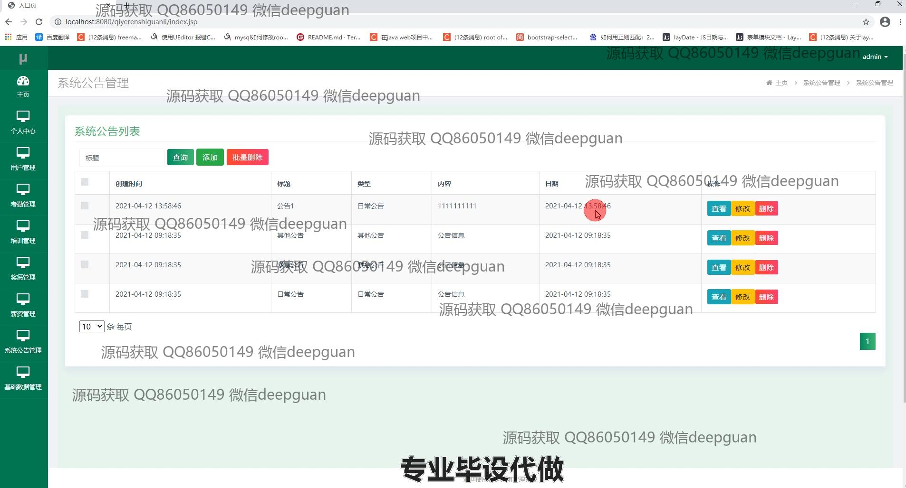
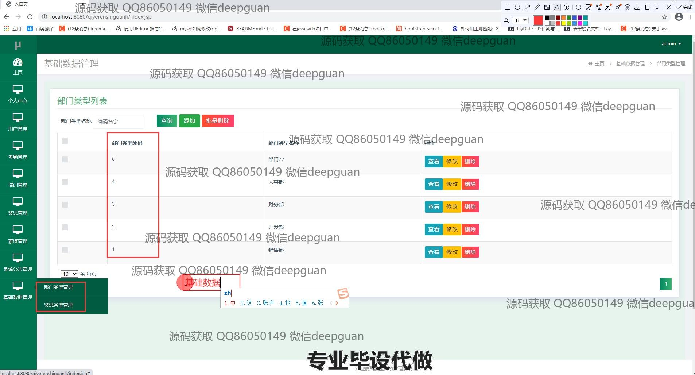
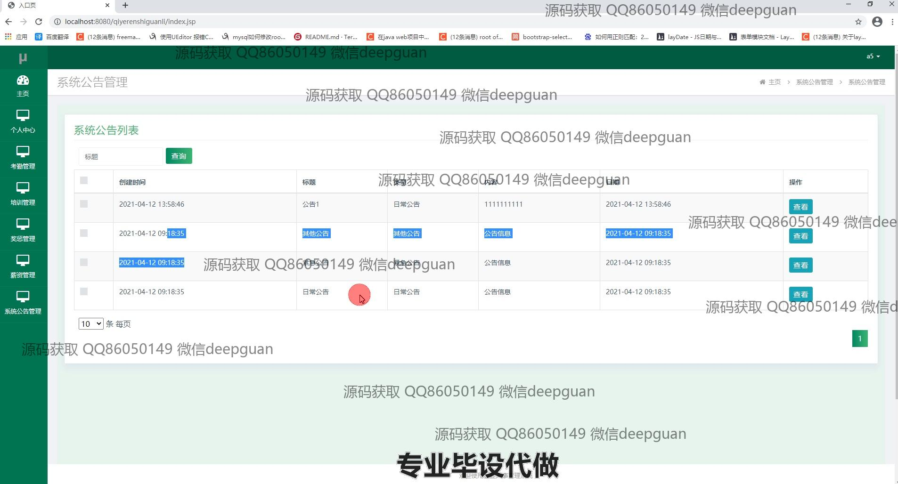

<h1 align="center">企业人事管理系统的设计与实现</h1>

## 简介
企业人事管理系统：角色分为管理员、用户；用户管理、考勤管理、培训管理、奖惩管理、薪资管理、系统公告管理等功能模块；提供数据统计和分析功能，增强人力资源管理效率和决策力。    --计算机毕业设计源码；毕设源码；java毕业设计源码

## 联系方式

<h3 align="center">获取完整代码与数据库文件 + 微信：deepguan QQ: 86050149 QQ群: 783742310</h3>

<h3 align="center">可帮忙远程部署 包运行成功！提供远程部署、修改代码、设计文档指导、代码讲解等服务！</h3>

## 功能介绍（完整见运行截图）
管理员：负责管理企业的全局设置和用户权限，包含人事档案管理、奖惩记录管理、薪资数据录入与维护、培训计划安排、公告发布与更新，提供考勤数据核查以及各模块数据统计分析，支持按员工查询、编辑、新增或批量删除信息，实现系统的高效运营和日常维护。

用户：可以查看及编辑个人信息，包括姓名、联系方式、身份证信息等，并参与个人中心模块中的奖惩记录、考勤数据、薪资明细和培训情况的查看与查询，允许员工自主上传和更新个人头像，以及进行在线培训和考勤打卡，确保信息的及时更新和准确性。

员工：能够访问个人信息查看功能，涉及个人考勤情况、工资发放情况、奖惩记录以及培训状态，通过在线系统提升个人时间管理及工作效率，对于有权限的员工，还可以进行部门内共有培训和绩效数据的查看与反馈，支持工作状态的自我管理和公司政策的了解。

主管：负责审核、审批和更新所属部门员工的各项人事操作，包括部门内员工出勤情况、奖惩核准、薪资审核，提供调动和辞退建议，可能进行部门结构调整以及岗位职责的分配，以确保部门内工作的有序开展及员工的积极性与业绩的提高。

## 运行截图

本代码来源于网络,仅供学习参考使用!

